# EXNO2DS
# AIM:
      To perform Exploratory Data Analysis on the given data set.
      
# EXPLANATION:
  The primary aim with exploratory analysis is to examine the data for distribution, outliers and anomalies to direct specific testing of your hypothesis.
  
# ALGORITHM:
STEP 1: Import the required packages to perform Data Cleansing,Removing Outliers and Exploratory Data Analysis.

STEP 2: Replace the null value using any one of the method from mode,median and mean based on the dataset available.

STEP 3: Use boxplot method to analyze the outliers of the given dataset.

STEP 4: Remove the outliers using Inter Quantile Range method.

STEP 5: Use Countplot method to analyze in a graphical method for categorical data.

STEP 6: Use displot method to represent the univariate distribution of data.

STEP 7: Use cross tabulation method to quantitatively analyze the relationship between multiple variables.

STEP 8: Use heatmap method of representation to show relationships between two variables, one plotted on each axis.

## CODING AND OUTPUT
import pandas as pd

import matplotlib.pyplot as plt

import seaborn as sns

df = pd.read_csv("titanic.csv")

print(df.head())

print(df.info())

print(df.describe())

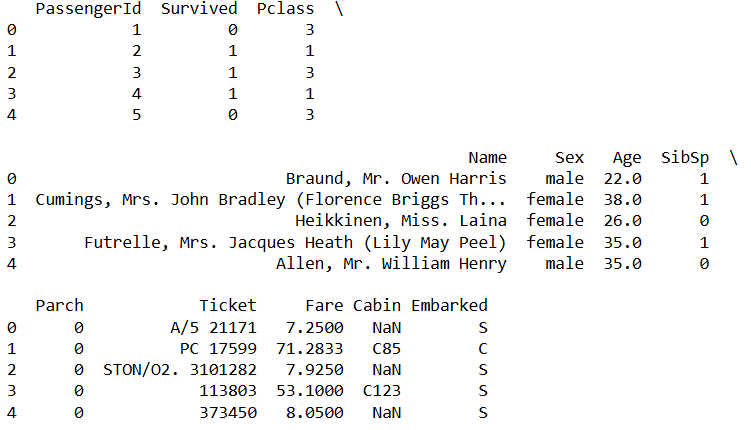

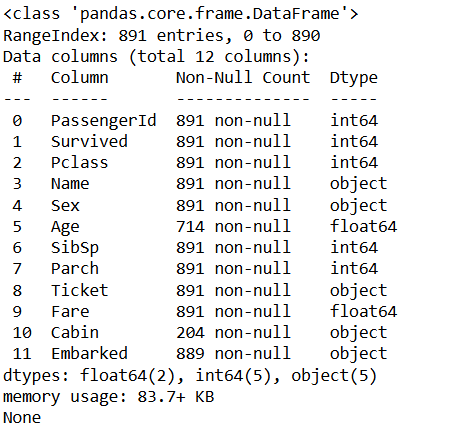

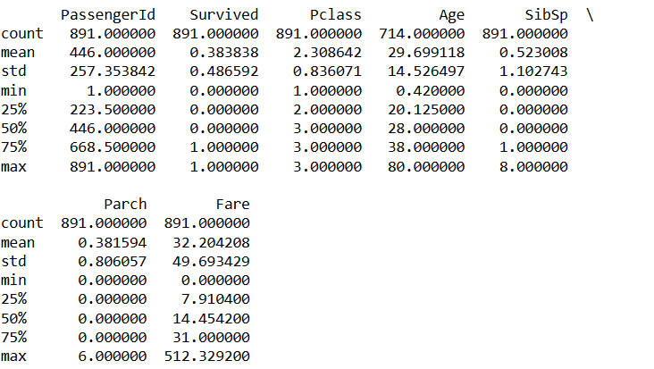

print(df.isnull().sum())

df['Age'].fillna(df['Age'].median(), inplace=True)

df['Embarked'].fillna(df['Embarked'].mode()[0], inplace=True)

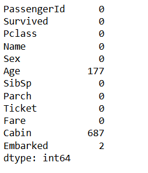

df.drop(columns=['Cabin'], inplace=True)

df.drop_duplicates(inplace=True)

plt.hist(df['Age'])

plt.title("Age Distribution")

plt.xlabel("Age")

plt.ylabel("Count")

plt.show()

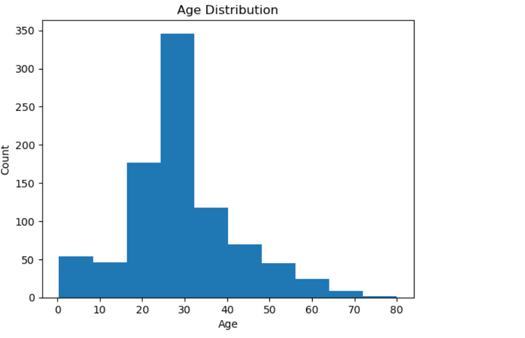

sns.countplot(x='Sex', data=df)

plt.title("Gender Count")

plt.show()

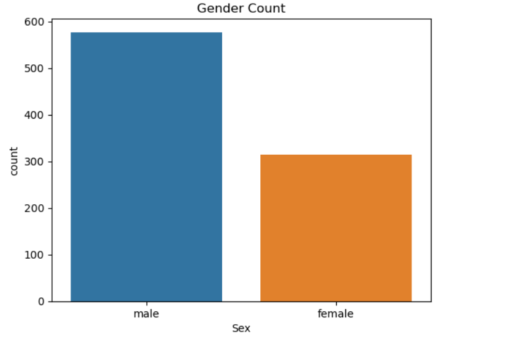

sns.countplot(x='Survived', hue='Sex', data=df)

plt.title("Survival by Gender")

plt.show()

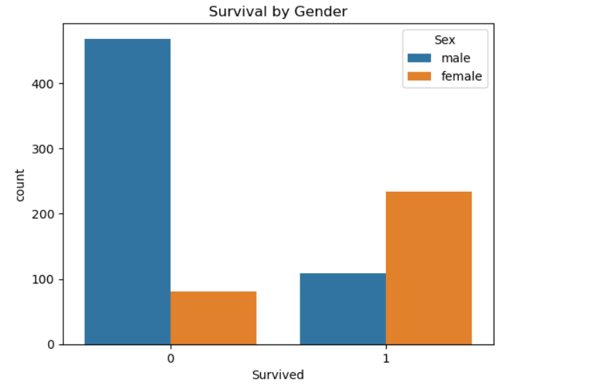

sns.countplot(x='Survived', hue='Pclass', data=df)

plt.title("Survival by Class")

plt.show()

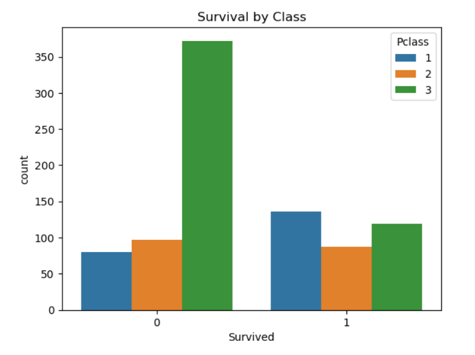

sns.boxplot(x='Survived', y='Fare', data=df)

plt.title("Fare vs Survival")

plt.show()

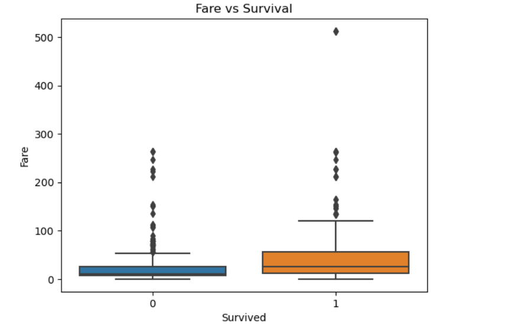

corr = df.corr(numeric_only=True)

sns.heatmap(corr, annot=True)

plt.title("Correlation Matrix")

plt.show()

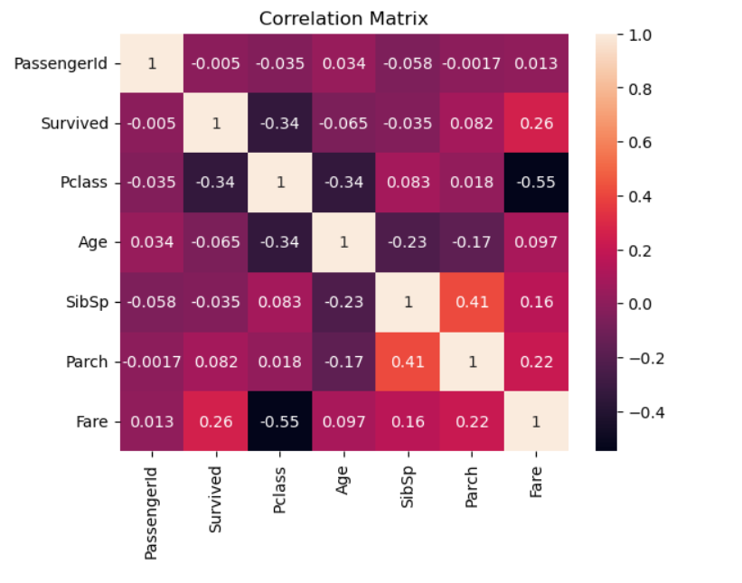

sns.boxplot(x=df['Fare'])

plt.title("Outliers in Fare")

plt.show()

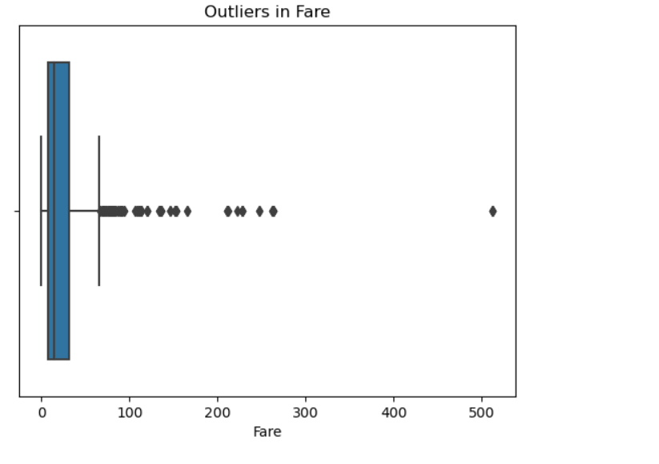
# RESULT
EDA helped in understanding the dataset clearly. Important features like gender, passenger class, and fare strongly influence survival. Data preprocessing is necessary before applying machine learning models.
